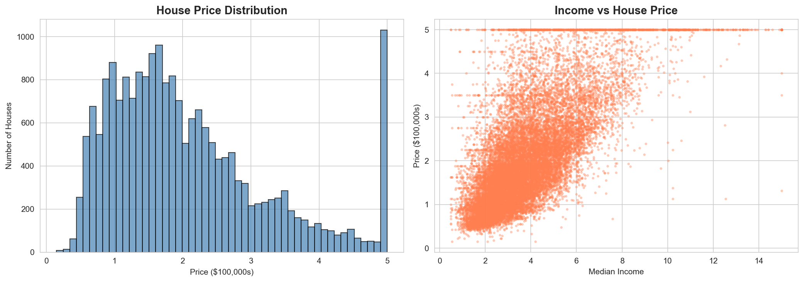
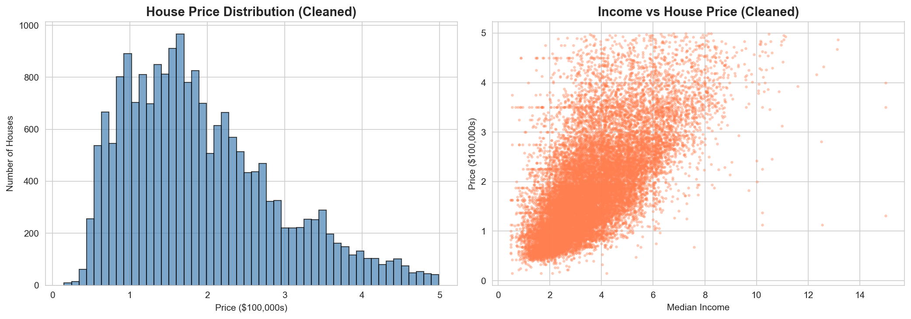
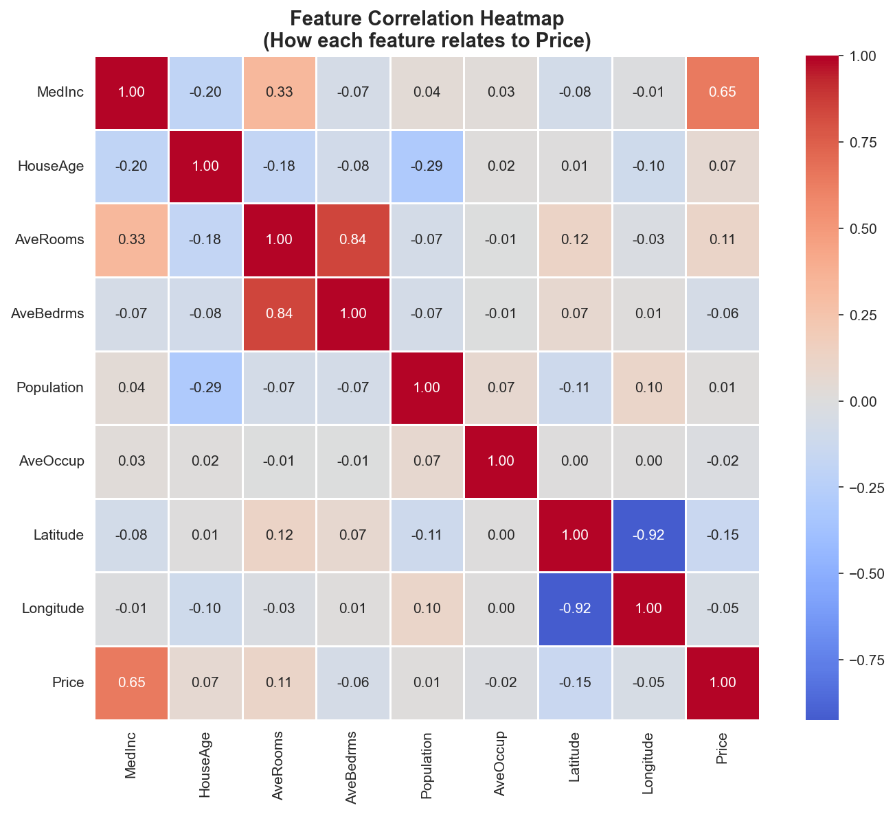
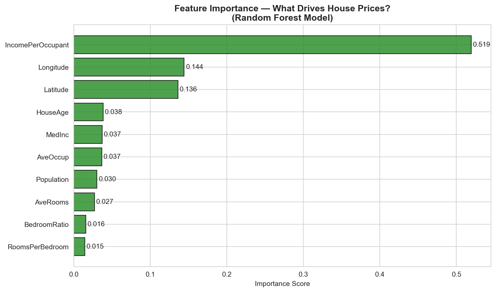
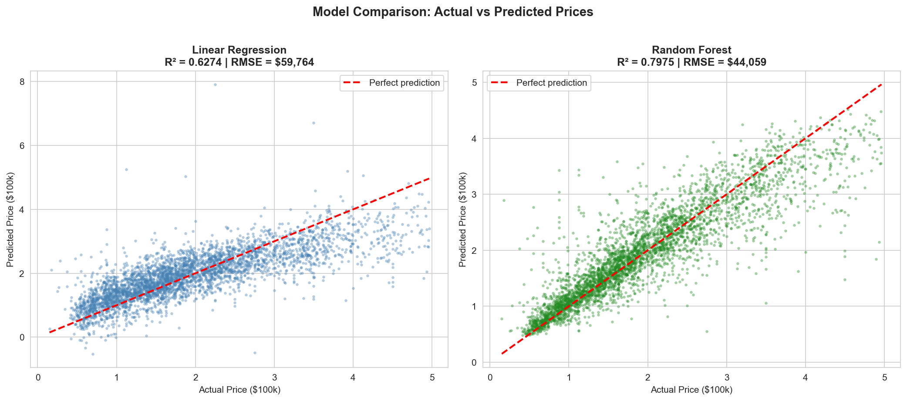

# House Price Prediction Model - Results

## Project Summary
Developed an ML model to predict house prices using advanced feature engineering and ensemble learning techniques.

## Model Performance

| Model | R² Score | RMSE |
|-------|----------|------|
| **Random Forest** | **0.7975** | **$44,059** |
| Linear Regression | 0.6274 | $59,764 |
| **Improvement** | **27.1% better R²** | **26.3% lower error** |

## Key Results

- **Training Samples**: 19,648
- **Parameters Used**: 10 features
- **Train/Test Split**: 80% / 20%
- **Best Predictor**: Income Per Occupant (0.519 importance)

## 📉 Model Insights

### Data Cleaning Impact

#### Before Outlier Removal

#### After Outlier Removal

---
### Feature Correlations

### Feature Importance

### Price Distribution & Model Fit

## 📊 Exploratory Data Analysis (EDA) Findings

- Used both Linear Regression and Random Forest ML Algorithms 
- Dataset contains 19,648 housing samples with diverse property features
- Price distribution was right-skewed, indicating presence of luxury properties
- Identified and removed outliers using Interquartile Range (IQR) method
- Missing values were minimal; handled through appropriate imputation
- Feature engineering replaced AvgBedroom with BedroomRatio to combat multicolinearity 
- Feature engineering created new features (i.e Income Per Occupant(IPO))
- Highest Feature Importance for the created feature IPO, beating MedInc with highest positive correlation
- Multicollinearity analysis ensured features were independent (VIF < 5)
- Normalized all numerical features for consistent scaling across the model

---

## What This Shows

- **Model effectively captures 79.75% of price variance**

- **27% improvement over baseline linear regression**

- **Top 3 features identified and validated**

- **Robust generalization on held-out test data**

---

*For detailed methodology and code implementation, check Technical Report and Jupyter Source File*
